# Cuyo-Brewers-Friends

You can view the app deployed: cuyo-brewers-friends.vercel.app

## Is a "social network" for home brewers in Argentina, where you can create, post recipes and rate them. Inspired by brewersfriend.com

I using MongoDB with Mongoose, Node.js and express for the backend,
and React-redux with Typescript for the frontend among others.

### The styles applied are just provisional.

  

### So far, you can register with a user and log in or log out.
### You can view the top rated recipes and the newest as well.

  

### You can search for a recipe by title, username or beer style.

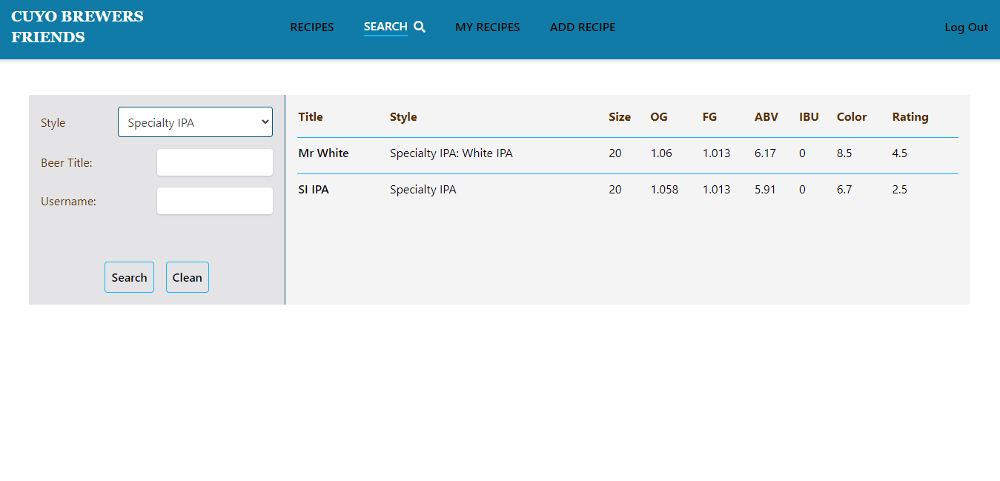
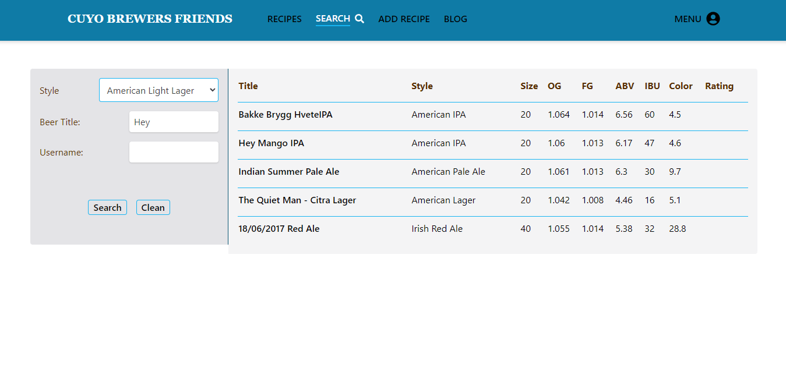

  

### You can create a recipe where the OG, FG, ABV and SRM are calculated automatically in real time.

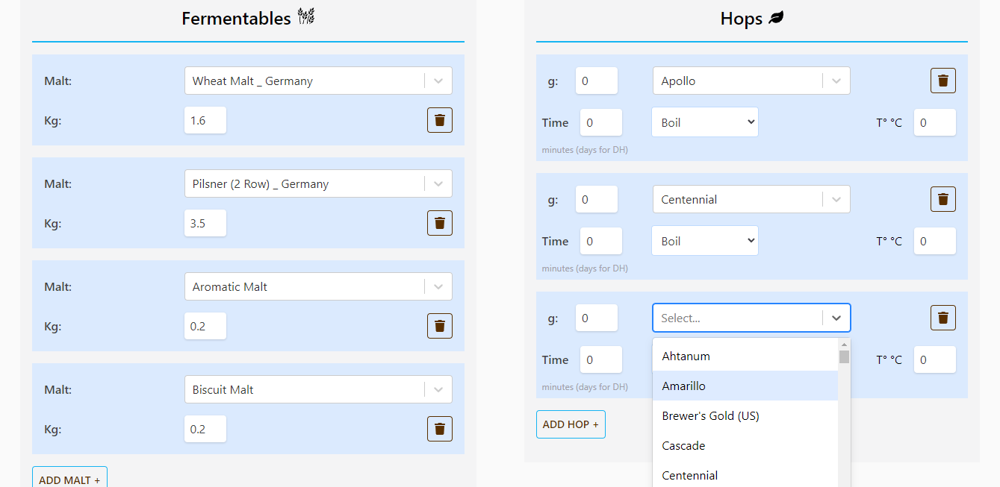
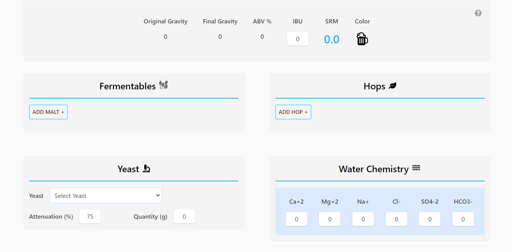
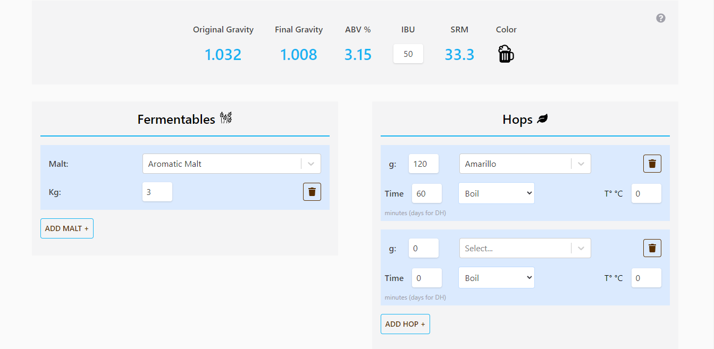

  

### You can see all your recipes.

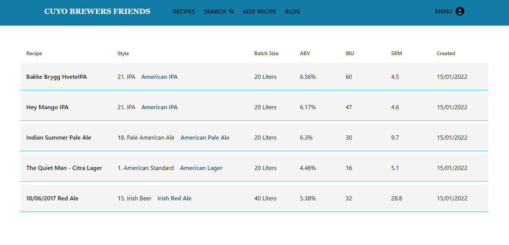

  

### You can view the recipe detail, with all the parameters.

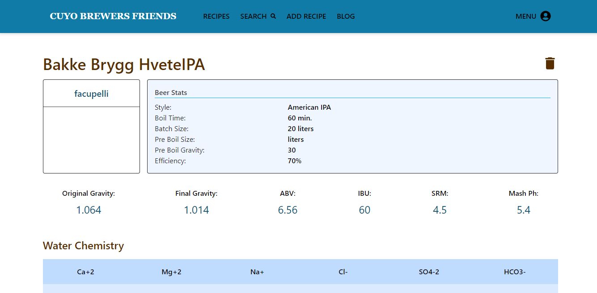
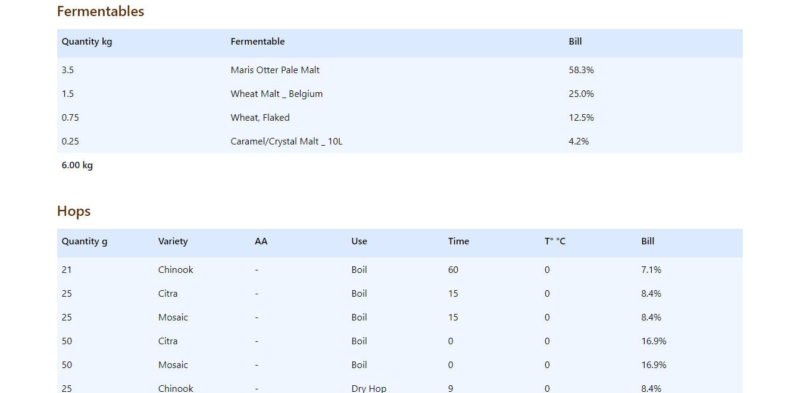

  

### You can rate it and post a comment.

### You can view your user profile or any other user profile

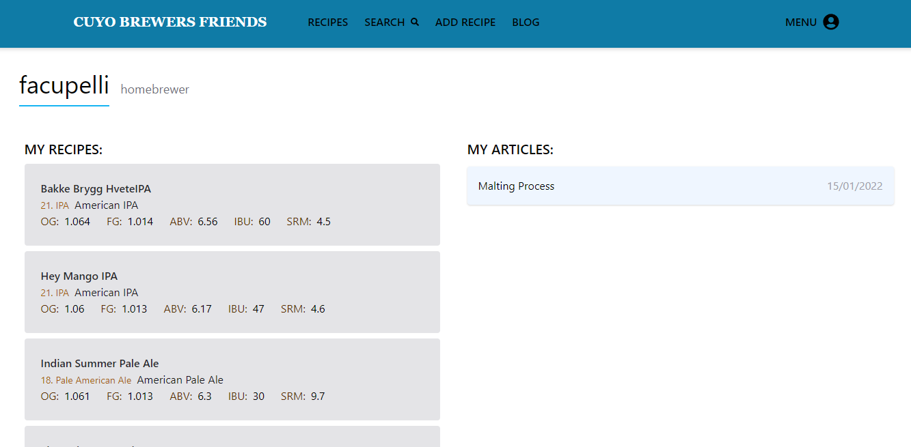

### You can add a recipe to favs

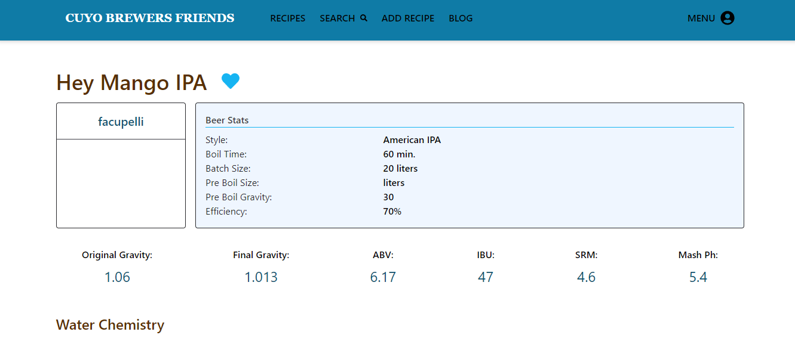

### Theres is a blog section, where you can post an article

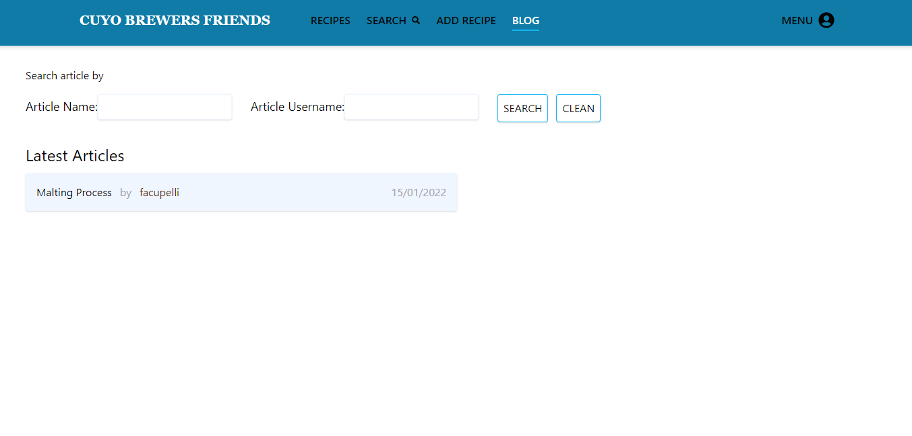
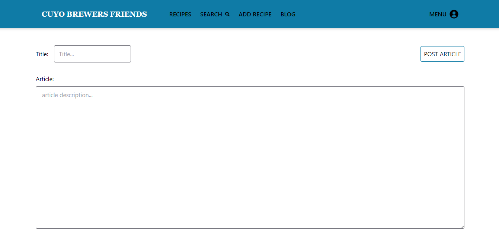

