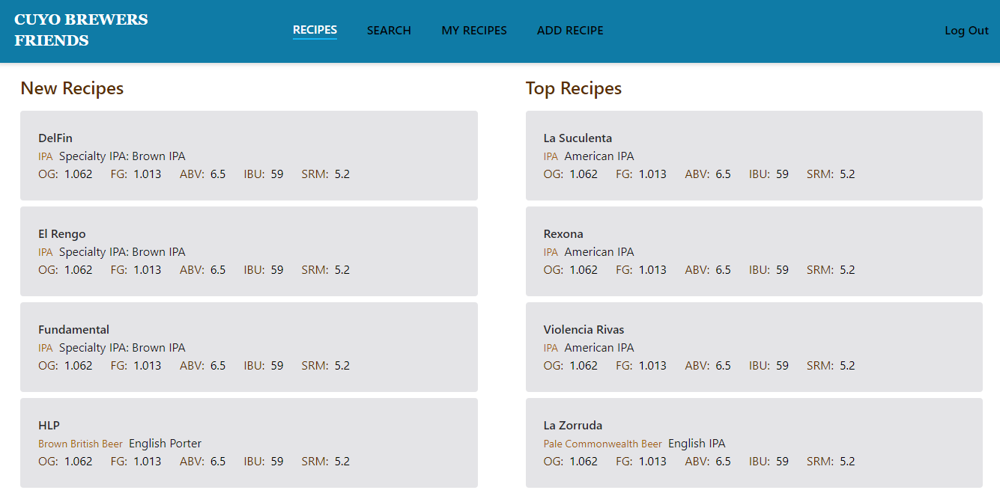
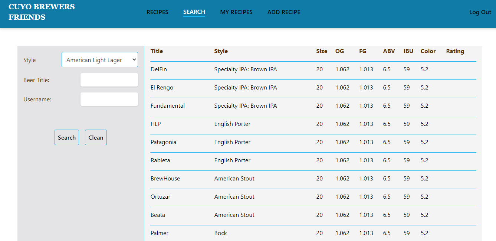
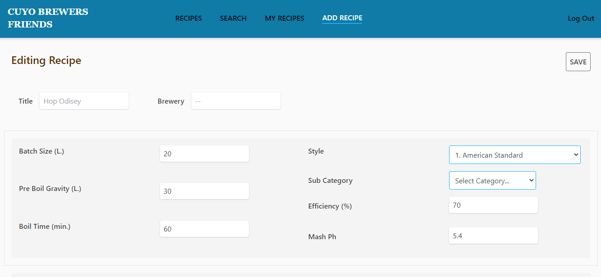
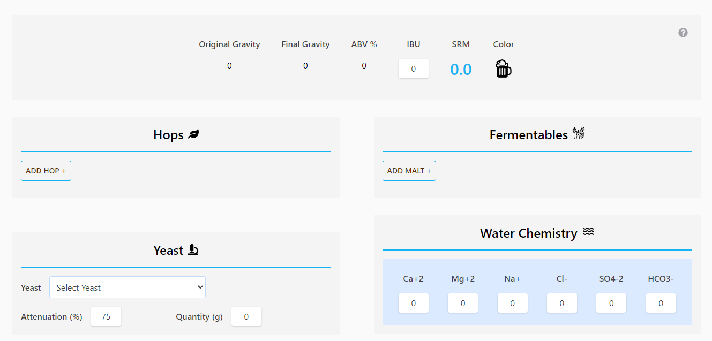
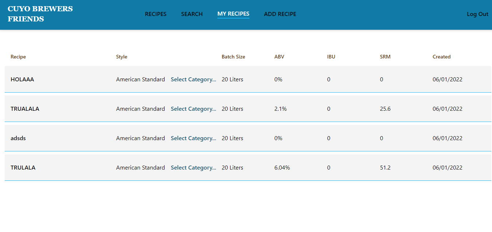
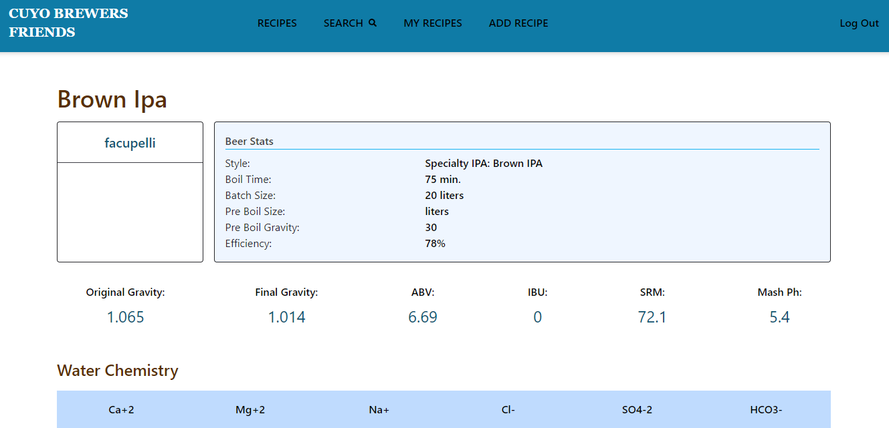
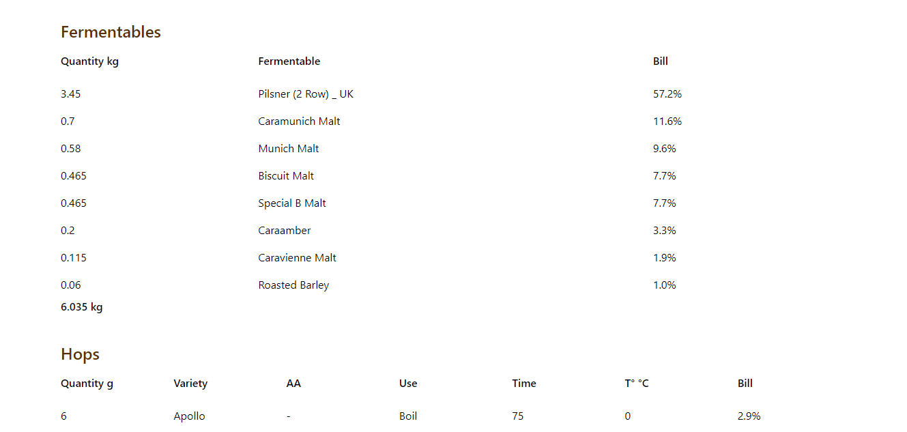
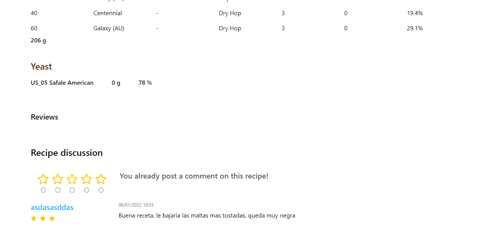

# Cuyo-Brewers-Friends

I'am currently working on this project.

## Is a "social network" for home brewers in Argentina, where you can create and post recipes and rate them. Inspired by brewersfriend.com

Im using mongoDB with mongoose, Node.js and express for the backend,
and React-redux with typescript for the frontend among others.

### The styles applied are just provisional.

So far, you con register a user and log in or log out.

You can view the top rated recipes and the newest as well.

You can search for a recipe by title or user.

You can create a recipe where the OG, FG, ABV and SRM are calculated automatically in real time.

You can see all your recipes.

You can view the recipe detail, with all the parameters.

You can rate it and post a comment.
